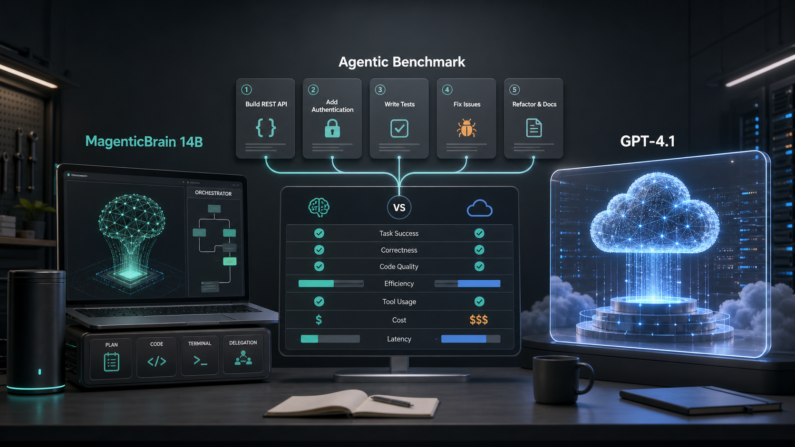

# magentic-local-bench



Benchmark suite that compares **MagenticBrain** (14B orchestrator from MagenticLite) running locally via Foundry Local against GPT-4.1 on multi-step agentic coding tasks.

Official MagenticBrain documentation: <https://labs.ai.azure.com/projects/magenticbrain/>

## Why

Microsoft just released MagenticLite with MagenticBrain, a 14B model fine-tuned from Qwen 3 14B that acts as planner, coder, and delegator. The question: **can a 14B local orchestrator match GPT-4.1 on structured multi-step tasks?**

This benchmark answers that with reproducible numbers.

## What it measures

- **Plan quality**: Does the orchestrator decompose tasks correctly?
- **Step accuracy**: Does each step produce the right output?
- **Token efficiency**: How many tokens does each model burn?
- **Latency**: Wall-clock time per task (local vs API)

## Tasks included

| Task | Steps | Description |
|------|-------|-------------|
| refactor-extract | 3 | Extract function, update imports, add tests |
| bug-triage | 4 | Read logs, identify root cause, propose fix, verify |
| api-scaffold | 3 | Design endpoint, implement handler, write OpenAPI spec |
| migration-plan | 4 | Audit deps, plan order, generate scripts, validate |
| review-respond | 3 | Parse PR comments, generate fixes, explain changes |

## Requirements

- Python 3.11+
- Foundry Local 1.1+ (for MagenticBrain)
- OpenAI API key or Azure OpenAI deployment (for GPT-4.1 comparison)

## Setup

```bash
pip install -r requirements.txt
```

## Cloud model configuration

For the GPT-4.1 comparison, choose either OpenAI or Azure OpenAI.

### OpenAI

```bash
export OPENAI_PROVIDER=openai
export OPENAI_API_KEY="sk-..."
```

### Azure OpenAI

```bash
export OPENAI_PROVIDER=azure
export AZURE_OPENAI_API_KEY="..."
export AZURE_OPENAI_ENDPOINT="https://YOUR-RESOURCE.openai.azure.com"
export AZURE_OPENAI_API_VERSION="2024-10-21"
export AZURE_OPENAI_DEPLOYMENT="YOUR-GPT-4.1-DEPLOYMENT"
```

When benchmarking multiple Azure deployments, set a model-specific deployment variable using the model name uppercased with punctuation replaced by underscores:

```bash
export AZURE_OPENAI_DEPLOYMENT_GPT_4_1="YOUR-GPT-4.1-DEPLOYMENT"
```

## Usage

```bash
# Run full benchmark
python bench.py --all

# Run single task
python bench.py --task refactor-extract

# Compare specific models
python bench.py --models magenticbrain,gpt-4.1

# Output results as JSON
python bench.py --all --output results.json
```

## Sample output

```
Task: refactor-extract
┌─────────────────┬──────────┬────────┬───────────┬─────────┐
│ Model           │ Plan OK  │ Steps  │ Tokens    │ Latency │
├─────────────────┼──────────┼────────┼───────────┼─────────┤
│ MagenticBrain   │ ✓        │ 3/3    │ 2,847     │ 4.2s    │
│ GPT-4.1         │ ✓        │ 3/3    │ 1,203     │ 2.1s    │
└─────────────────┴──────────┴────────┴───────────┴─────────┘
```

## How it works

1. Each task has a structured prompt and expected plan/output schema
2. The orchestrator model receives the task and produces a plan + execution steps
3. A validator checks plan structure and step outputs against ground truth
4. Metrics are collected and compared across models

## Key insight

MagenticBrain is surprisingly capable at orchestration for a 14B model. On planning tasks it matches GPT-4.1 accuracy while running fully offline. The tradeoff is token verbosity (roughly 2x) and latency on CPU-only setups.

## License

MIT
